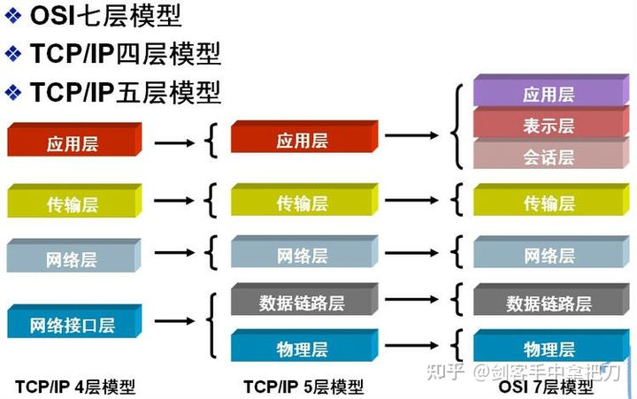
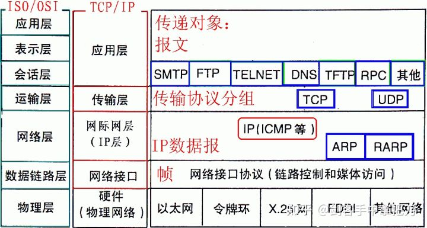

OSI七层网络模型

TCP/IP协议毫无疑问是互联网的基础协议，没有它就根本不可能上网，任何和互联网有关的操作都离不开TCP/IP协议。不管是OSI七层模型还是TCP/IP的四层、五层模型，每一层中都要自己的专属协议，完成自己相应的工作以及与上下层级之间进行沟通。由于OSI七层模型为网络的标准层次划分，所以我们以OSI七层模型为例从下向上进行一一介绍。

1）物理层

该层为上层协议提供了一个传输数据的可靠的物理媒体。简单的说，物理层确保原始的数据可在各种物理媒体上传输

2）数据链路层（Data Link Layer）

数据链路层在物理层提供的服务的基础上向网络层提供服务，其最基本的服务是将源自网络层来的数据可靠地传输到相邻节点的目标机网络层。为达到这一目的，数据链路必须具备一系列相应的功能，主要有：如何将数据组合成数据块，在数据链路层中称这种数据块为帧（frame），帧是数据链路层的传送单位；如何控制帧在物理信道上的传输，包括如何处理传输差错，如何调节发送速率以使与接收方相匹配；以及在两个网络实体之间提供数据链路通路的建立、维持和释放的管理。数据链路层在不可靠的物理介质上提供可靠的传输。该层的作用包括：物理地址寻址、数据的成帧、流量控制、数据的检错、重发等。

有关数据链路层的重要知识点：

数据链路层为网络层提供可靠的数据传输； 基本数据单位为帧； 主要的协议：以太网协议； 两个重要设备名称：网桥和交换机 3）网络层（Network Layer）

网络层负责对子网间的数据包进行路由选择。此外，网络层还可以实现拥塞控制、网际互连等功能； 基本数据单位为IP数据报； 包含的主要协议： IP协议（Internet Protocol，因特网互联协议）;
ICMP协议（Internet Control Message Protocol，因特网控制报文协议）; ARP协议（Address Resolution Protocol，地址解析协议）;
RARP协议（Reverse Address Resolution Protocol，逆地址解析协议）。 重要的设备：路由器。 4）传输层（Transport Layer）

网络层只是根据网络地址将源结点发出的数据包传送到目的结点，而传输层则负责将数据可靠地传送到相应的端口。 有关网络层的重点：

传输层负责将上层数据分段并提供端到端的、可靠的或不可靠的传输以及端到端的差错控制和流量控制问题； 包含的主要协议：TCP协议（Transmission Control
Protocol，传输控制协议）、UDP协议（User Datagram Protocol，用户数据报协议）； 重要设备：网关。 5）应用层

为操作系统或网络应用程序提供访问网络服务的接口。

会话层、表示层和应用层重点：

数据传输基本单位为报文； 包含的主要协议：FTP（文件传送协议）、Telnet（远程登录协议）、DNS（域名解析协议）、SMTP（邮件传送协议），POP3协议（邮局协议），HTTP协议（Hyper
Text Transfer Protocol） 网络层及以上，每一层都要对上一层发送的数据进行处理（加个头部）

数据链路层不仅需要加头部，还需要加尾部

物理层什么都不加，只管发送数据（比特流）