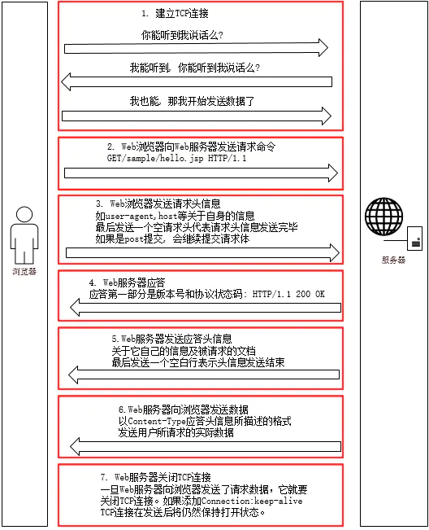
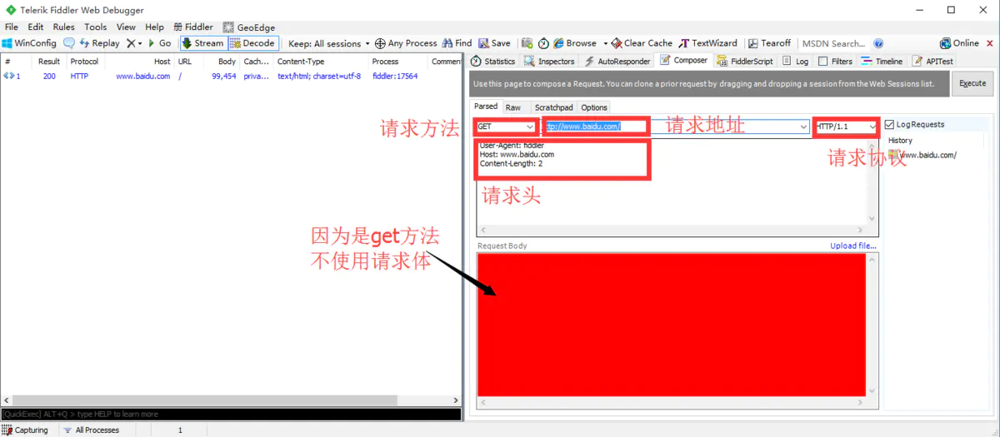
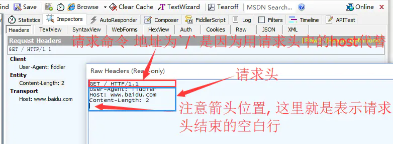
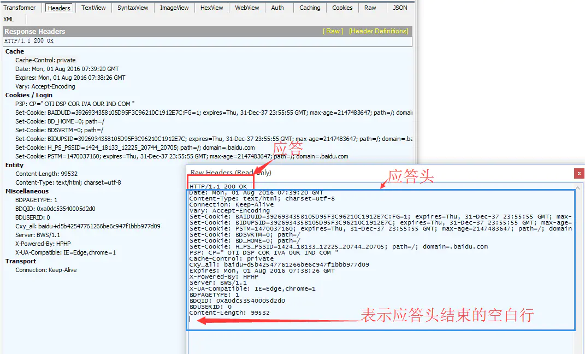
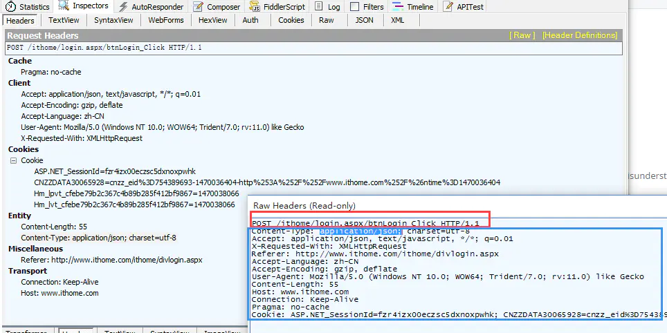
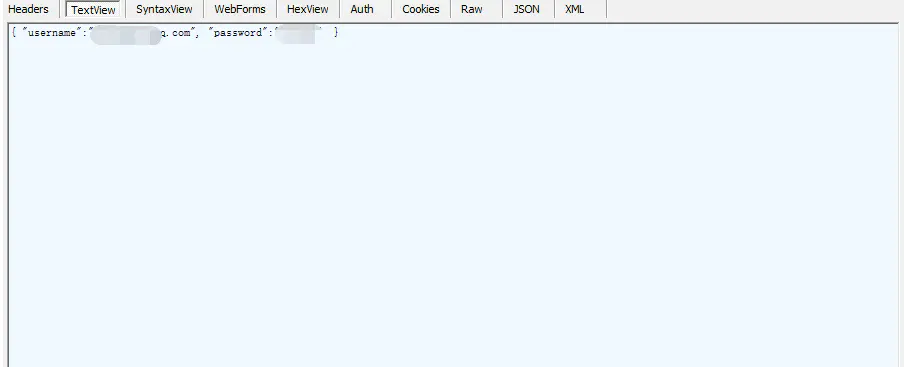
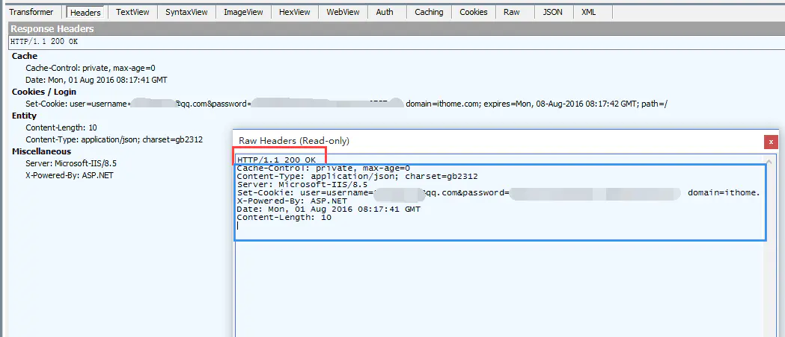
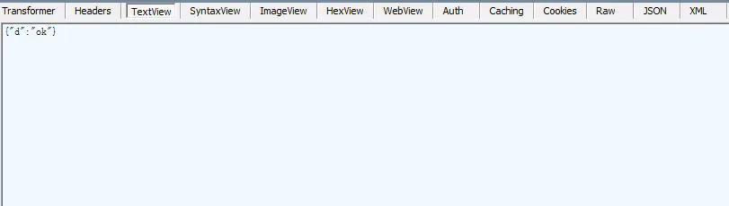

## 一、http请求和响应步骤

在讲解OkHttp之前, 我们首先来个高清大图, 看下http请求的整个步骤, 有个整体概念.


## 二、http每一步详细内容

在一次完整的HTTP通信过程中, Web浏览器与Web服务器之间将完成下列7个步骤:

### 2.1 建立TCP连接

在HTTP工作开始之前, Web浏览器首先要通过网络与Web服务器建立连接, 该连接是通过TCP来完成的, 该协议与IP协议共同构建Internet, 即著名的TCP/IP协议族,
因此Internet又被称作是TCP/IP网络. HTTP是比TCP更高层次的应用层协议, 根据规则, 只有低层协议建立之后才能进行更高层协议的连接, 因此, 首先要建立TCP连接,
一般TCP连接的端口号是80. TCP连接中我们比较熟悉的就是三次握手, 但是为什么是三次而不是两次或四次呢? 这里我想到了一个比喻来让大家明白.

```c

敌人封锁江面, 我方间谍和联络员只能通过电报机隔着江面交流. 但是那时的电报机质量不稳定, 有可能会出现失灵的情况. 所以就出现了如下对话:

间谍: 联络员, 你能收到我发的话么? 你要是能收到, 就说明我这个电报机可以发电报.

联络员: 间谍, 我收到你发的话了, 这说明我的电报机可以收. 但是我不确定我的电报机能不能发, 你能收到我发的这句话么? 你要是能收到, 就说明我的电报机是可以发电报的.

间谍: 联络员, 我收到你的话了. 我的电报机也是能发能收, 我们可以正式交流情报了.

```

这个故事代表了tcp的三次握手, 确定了client和server的发送和接收功能都正常. 如果只发送两次, 那么不能确定client和server都能正常收发; 如果发送四次或者更多,
理论上当然也是可以的, 但是网络环境十分复杂, 任何两次请求间都可能出现错误, 多出的请求次数并无法确保下一个请求一定安全. 希望通过这个故事让大家明白为什么会有tcp三次握手.

### 2.2 Web浏览器向Web服务器发送请求命令

一旦建立了TCP连接, Web浏览器就会向Web服务器发送请求命令

例如：GET/sample/hello.jsp HTTP/1.1

### 2.3 Web浏览器发送请求头信息

浏览器发送其请求命令之后, 还要以头信息的形式向Web服务器发送一些别的信息, 这些信息用来描述浏览器自己. 之后浏览器发送了一空白行来通知服务器, 表示它已经结束了该头信息的发送.
若是post请求, 还会在发送完请求头信息之后发送请求体.

### 2.4 Web服务器应答

客户机向服务器发出请求后, 服务器会向客户机回送应答.

HTTP/1.1 200 OK

应答的第一部分是协议的版本号和应答状态码

### 2.5 Web服务器发送应答头信息

正如客户端会随同请求发送关于自身的信息一样,服务器也会随同应答向用户发送关于它自己的数据及被请求的文档. 最后以一个空白行来表示头信息发送到此结束.

### 2.6 Web服务器向浏览器发送数据

Web服务器向浏览器发送头信息后, 它就以Content-Type应答头信息所描述的格式发送用户所请求的实际数据

### 2.7 Web服务器关闭TCP连接

一般情况下, 一旦Web服务器向浏览器发送了请求数据, 它就要关闭TCP连接. 如果浏览器或者服务器在其头信息加入了这行代码 Connection:keep-alive
TCP连接在发送后将仍然保持打开状态. 于是, 浏览器可以继续通过相同的连接发送请求. 保持连接节省了为每个请求建立新连接所需的时间, 还节约了网络带宽.

### 3. 使用fiddler抓包验证请求信息和响应信息

这里, 给大家推荐一个抓包工具fiddler, 免费好用. 而且可以在本机设置代理, 直接抓取同局域网的android或ios手机的数据包, 如果需要请谷歌fiddler android.
这里我们安装fiddler后, 打开composer, composer可以直接构建http请求并执行.

### 3.1 get的请求和应答

我们首先构建一个get请求, 设置如下:



可以看到, 我们需要设置请求方法, 请求地址, 请求协议和请求头. 点击execute, 即可执行我们的请求. 上图左栏即是我们请求的结果, 点击查看. 下图就是我们http请求的raw数据,
raw代表没有为了方便观看而格式化的数据.



接下来看下我们请求的应答:



### 3.2 post的请求和应答 post请求, 因为涉及到需要上传的请求体, 手头没有现成的服务器, 所以我们用ithome的登陆来举例说明. 下图是登陆时post的具体数据:



我们分析下, 其请求方法为post, 请求地址为btnLogin_Click, 请求协议为HTTP/1.1. 然后是请求头, 请求头中有一个比较重要的设置是Content-Type:
application/json; charset=utf-8. 表示我们会上传一个json文件, json文件的格式是utf-8, 这里面保存的就是用户名和密码,
通过post请求在请求体中传输给服务器.

json文件具体内容是:


这正验证了我们上文所说.

我们看下post请求的响应:



我们又看到了Content-Type: application/json; charset=gb2312, 这说明在响应头结束后, 会有一个gb2312编码的json. 我们看下这个json的内容:



看到我们的请求返回的内容就是ok, 代表有这个用户名和密码正确.

## 四、结语

希望通过这一节, 让大家对http协议有个整体上的认识, 清楚get和post请求和响应的组成. 如果我们要写一个库来完成http协议的功能, 那么我们应该需要控制 请求方法: get/post,
请求地址: url, 请求协议: http/1.1, 请求头: 描述自身信息, 请求体:
post时才有, 有了这些我们才能构建一个http请求. 当响应时, 我们应该需要一些字段代表 应答协议: http/1.1, 响应码: 200, 应答头: content-type等描述自身信息,
响应体: 如json, html等, 这样我们才能完全的表示我们的返回响应. 有了这些概念, 下一节, 我们讲解OkHttp将会特别轻松愉快. 因为OkHttp完成的就是get或post请求,
所以OkHttp中就有类来代表我们刚才讲到的 请求方法, 请求地址, 请求协议等概念, 了解了OkHttp中的这些类, 那么OkHttp你也就学会怎么使用了.


