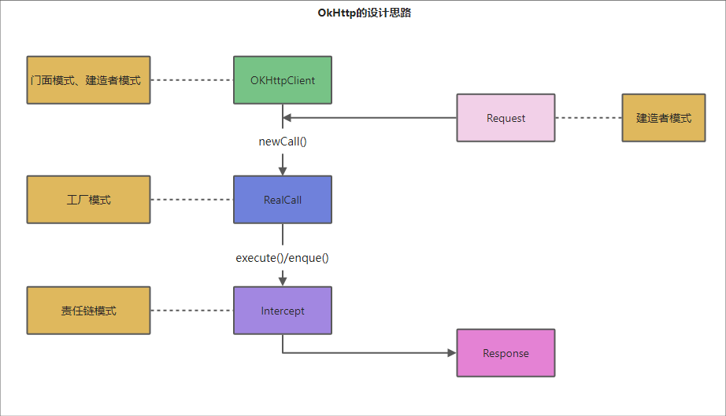

链接：https://www.cnblogs.com/it-tsz/p/11748674.html

## 前言

OkHttp是一个用于Android、Kotlin、Java的HTTP客户端，性能高效，API封装友好，主要有如下特点：

- 提供了对 HTTP/2 和 SPDY 的支持，这使得对同一个主机发出的所有请求都可以共享相同的Socket套接字连接
- 如果 HTTP/2 和 SPDY 不可用，OkHttp
- 会使用连接池来复用连接以提高效率 提供了对GZIP的默认支持来降低传输内容的大小
- 提供了对HTTP响应的缓存机制，可以避免不必要的网络请求 当网络出现问题时，OkHttp 会自动重试一个主机的多个IP地址
  如果服务端拥有多个IP，OkHttp会在请求失败的情况下尝试其他IP，这对于IPv4 + IPv6数据中心中托管的多活服务是很有必要的
- OkHttp支持TLS功能；

## 一、OKHttp的设计思路

OkHttp的API设计对开发者友好，设计为链式风格的Builder，并且支持同步阻塞调用和异步回调调用。

Requests（请求）

每一个HTTP请求中都应该包含一个URL，一个GET或POST方法以及Header或其他参数，当然还可以含特定内容类型的数据流。

Responses（响应）

响应则包含一个回复代码（200代表成功，404代表未找到），Header和定制可选的body。

## 二、使用教程

